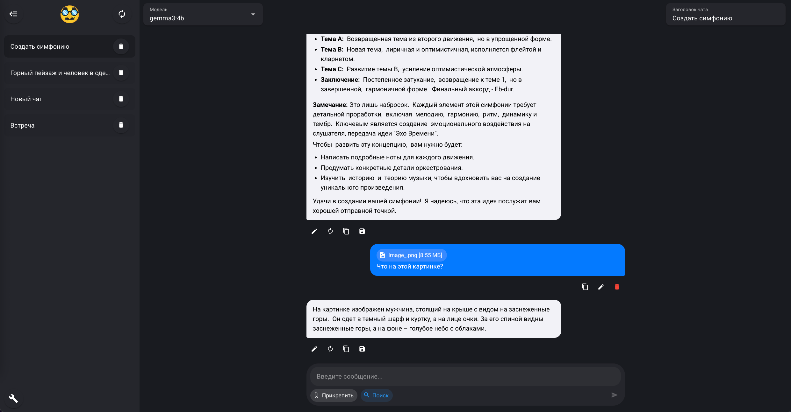

**PrivateGPT** is a local AI client replicating the functionality of ChatGPT, Grok, and Yandex Alice — but fully private and self-hosted.


### 💡 Why PrivateGPT?

> A full-featured local AI client with private memory, fast search, flexible prompts, and a clean codebase you can extend freely.



### 🚀 Features

* 💬 Works with local LLMs via **Ollama**
* 🧠 Persistent memory (summarization-based), like GPT
* 🔍 Internet search and check provided links
* * 🔎 Chat sessions with system prompt filters
* 📄 Upload and analyze text documents (RAG supports `.txt`, more formats planned)
* 🖼️ Supports image input in chat
* ⚡ Quick system prompt snippets
* ⚙️ Minimal, easily adaptable codebase

### 🚀 In Development

* 🔗 Chat list with system prompt filters
* 🎤 Voice chat support
* 🚀 Support for third-party API tools
* 🗋 Better support for various document formats in RAG

### ⚙️ Required Models

Download and configure via Ollama:

1. **Any general model**
2. **RAG model** (used for document-based retrieval and memory)
3. **Image generation model**

### 🌐 Optional: SearXNG Search Engine

To enable internet search, you can run SearXNG:

```bash
docker run --restart=always -d -p 8888:8080 \
  -v "./searxng:/etc/searxng:rw" \
  -e "BASE_URL=http://localhost:9090/" \
  -e "INSTANCE_NAME=SearXNG" \
  --name SearXNG searxng/searxng
```

Or:

```bash
docker run -d \
  --name searxng \
  -p 8888:8888 \
  -v ~/searxng-config:/etc/searxng \
  searxng/searxng
```

### 📦 Installation

This is a **monorepo** containing both frontend and backend parts.

First, install dependencies for both root and backend:

```bash
pnpm install
pnpm --prefix backend install
pnpm --prefix backend exec node node_modules/puppeteer/install.js
```

Then, to run the app in development mode:

```bash
pnpm dev
```

Or to launch the Electron app:

```bash
pnpm dev:electron
```

### ⚠️ Threshold

For Mac on an M-chip:

```bash
cd backend/node_modules/.pnpm/better-sqlite3@*/node_modules/better-sqlite3
npx node-gyp rebuild
```

### 🌐 Roadmap

* 🔍 Better local document indexing and RAG refinement
* 🎤 Optional voice input/output (speech-to-text + TTS)
* ⚖️ API integration support (external tools or agents)
* 🌍 Interface multilingual support

### 📄 License

[Apache License](https://github.com/alexup71rus/PrivateGPT/blob/master/LICENSE)

### 📧 Contact

TG: [@alexup71rus](https://t.me/alexup71rus)
