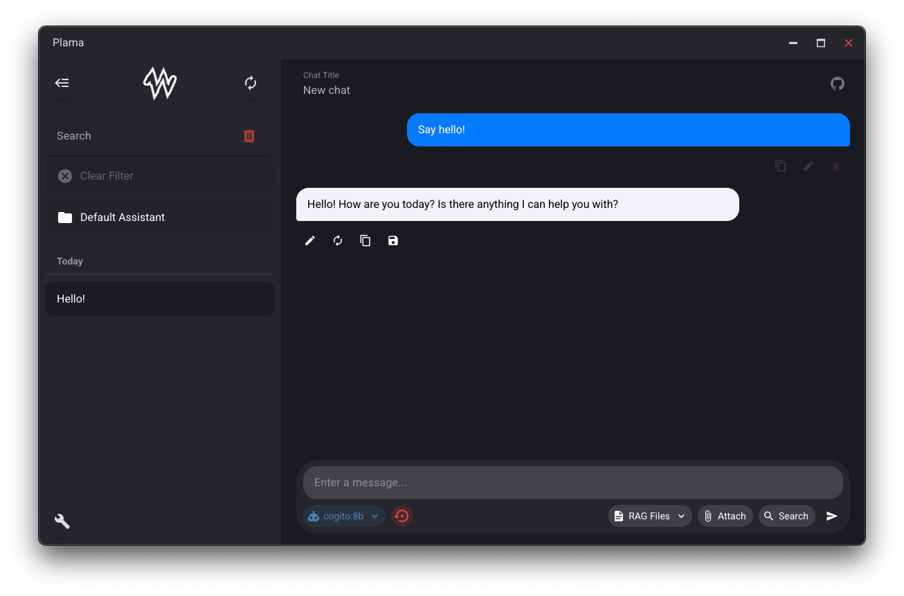

## 🌍 English [[RU](https://github.com/alexup71rus/PrivateGPT/blob/master/README.RU.md)]

**PrivateGPT** is a local AI client replicating the functionality of ChatGPT, Groq, and Yandex Alice — but fully private and self-hosted.


### 💡 Why PrivateGPT?

> A full-featured local AI client with private memory, fast search, flexible prompts, and a clean codebase you can extend freely.




### 🚀 Features

* 💬 Works with local LLMs via **Ollama**
* 🧠 Persistent memory (summarization-based), like GPT
* 🖼️ Image generation
* 📁 Chat folders for organizing by project
* 🔍 Search to the internet
* 📄 Upload and analyze documents
* 🖼️ Upload and view images
* ⚡ Custom prompt snippets
* ⚙️ Minimal, easily adaptable codebase

### ⚙️ Required Models

Download and configure via Ollama:

1. **Summarization model** (used for persistent memory and generation titles)
2. **RAG model** (used for persistent memory)
3. **Image generation model**

### 🌐 Optional: SearxNG Search Engine

To enable search, run SearxNG:

```bash
docker run --restart=always -d -p 8888:8080 \
  -v "./searxng:/etc/searxng:rw" \
  -e "BASE_URL=http://localhost:9090/" \
  -e "INSTANCE_NAME=SearXNG" \
  --name SearXNG searxng/searxng
```

Or:

```bash
docker run -d \
  --name searxng \
  -p 8888:8888 \
  -v ~/searxng-config:/etc/searxng \
  searxng/searxng
```

### 📦 Installation

```bash
pnpm install
pnpm dev
```

### 📄 License

[Apache License
](https://github.com/alexup71rus/PrivateGPT/blob/master/LICENSE)